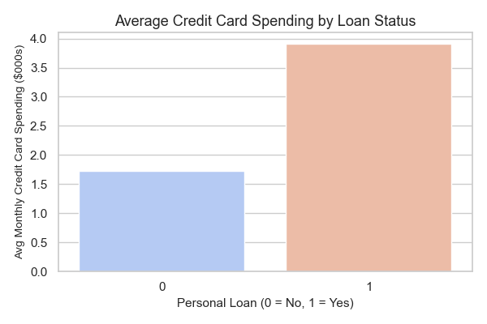

**Loan Default Risk Analysis (Bank Personal Loan Modeling)**

### **Overview**

This project analyzes customer financial behavior using a personal loan dataset from a banking institution. The aim is to identify the key traits that influence personal loan acceptance — including income level, spending patterns, and mortgage burden — to help financial institutions reduce loan default risk and better target credit-worthy customers.

### **Dataset**

* **Source:** Kaggle (Bank Personal Loan Modeling Dataset)
* **Filename:** Bank\_Personal\_Loan\_Modelling.csv
* **Rows:** 5,000
* **Columns:** 14
* **Scope:** Customer-level demographics, income, spending, and loan status (binary target)

### **Analysis Summary**

**1. Class Imbalance Check**
We found that nearly 90.4% of customers did **not** accept a personal loan. Only 9.6% did, which creates a strong class imbalance. This is critical when designing classification models later.

**2. Data Cleaning**
Removed rows with negative `Experience` values. These were clearly invalid. All features were validated for type, nulls, and consistency.

**3. Outlier Detection**
We performed individual boxplots and descriptive analysis on key numerical variables:

* **Income:** Heavily right-skewed with values >\$200K; identified high-income outliers.
* **Age:** Mostly between 30–60 years; no major outliers but slightly skewed.
* **Mortgage:** High variance, with a few customers holding mortgages >\$600K.
* **Credit Card Spend:** Outliers in CCAvg suggest a small segment of high spenders.

**4. Correlation Matrix**
Created a correlation heatmap to identify multicollinearity and predictive strength.

* `Income` is strongly correlated with `CCAvg` and `Mortgage`.
* `Personal Loan` correlates moderately with `Income`, `CD Account`, and `Online` usage.

**5. Feature Engineering: Income-to-Loan Ratio**
Created a new feature `income_by_loan` = Income / (Mortgage + 1), to help evaluate financial stretch of applicants.

### **Visualizations**

* 
* 
* 
* 
* 
* 

### **Key Business Insights**

**Income remains the strongest indicator** of loan acceptance — high-income customers are more likely to be approved or apply.
**Education level and online usage** also show slight positive influence on loan status.
**Credit card usage (CCAvg)** correlates with income and may serve as a proxy for financial engagement.
**Age distribution is balanced**, so age is not a discriminatory feature in loan approval.
**Mortgage values vary widely**, but do not strongly affect loan outcomes without additional features.
**Outliers must be handled carefully** to avoid skewing model predictions.

### **Business Recommendations**

1. **Prioritize Income-Based Segmentation**
   Target individuals with high and stable incomes, as they show a stronger tendency to accept loans.

2. **Leverage Online Behavior for Targeting**
   Online users are more loan-savvy and may respond better to digital campaigns. Banks can upsell personal loans via online channels.

3. **Handle Outliers with Caution**
   Very high-income or mortgage values can skew models. Apply capping or transformation techniques.

4. **Balance Class Distribution**
   Due to extreme imbalance in the target variable, modeling should use techniques like SMOTE, undersampling, or class weights.

5. **Include Engineered Features**
   Ratios like `income_by_loan` help add more depth to financial evaluation and improve prediction reliability.

### **Conclusion**

This analysis showed me the foundation for a customer's personal loan default prediction system. By focusing on meaningful attributes such as- income, financial behavior, and  other ratios and by cleaning outliers and the imbalances the dataset is now modeling ready. Banks can use these insights to design smarter and potential loan approval policies and improve the customer targeting.

**Created by:** Tabassum Arshad
**Tools Used:** Python, Pandas, Seaborn, Matplotlib
